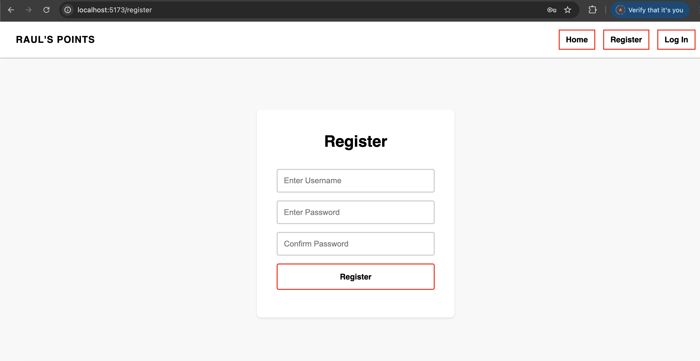
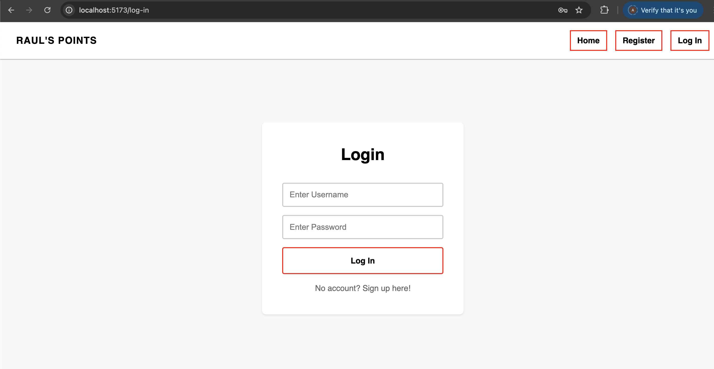
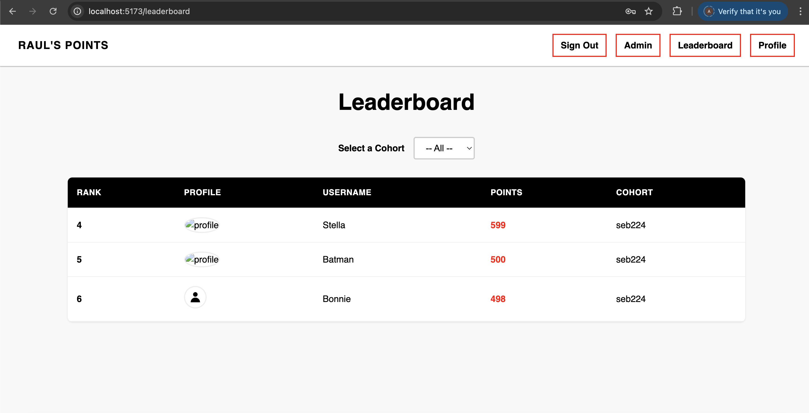

# Raul's points
**Raul's points** is a Django application with full CRUD. The app allows the admin user(Raul) to record and manage imaginary points earned by students througout different cohorts. 

## Features
 - Django templates for rendering templates to users
-  Django built-in session-based authentication.
-  Full CRUD functionality.

## Technologies
- Python
- Javascript 
- Cursor
- Django
- Chatgpt
- SQL

## Preview
**Landing page**

**Registration page**

**Login**
 

**Leader Board**

**Admin panele**

## Future additions
- As a user, I want to receive badges for milestones (e.g., 100 points).

- As a user, I want to leave positive shout-outs on other users’ profiles.

- As a user, I want to view my badge collection on my profile.

- As a user, I want to view all-time, daily, and cohort-specific leaderboards.

## Links
- https://trello.com/b/AJIzZlW7/rauls-points-scoreboard
